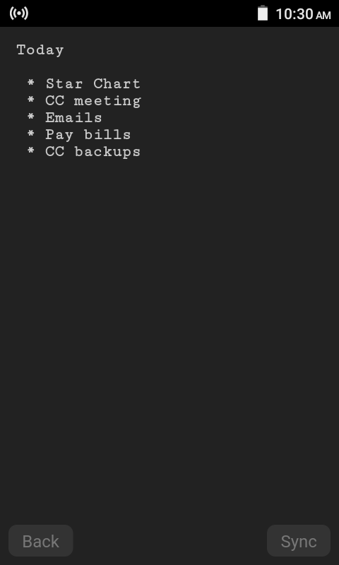
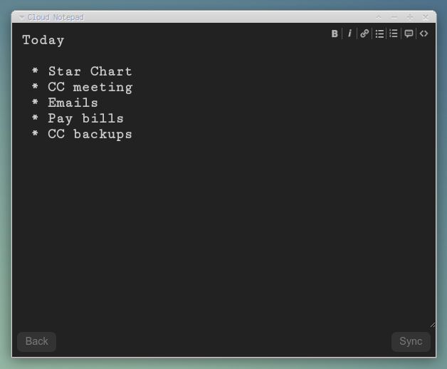

Note taking application with sync.

 * Self-hosted (PHP server).
 * Text-file backed, no database required.
 * "Add to homescreen" on phones.

## Installation

 * Copy files up
 * Make a data dir for notebook pages to go into
 * Copy config-example.php to config.php
 * Edit config.php

## This fork

 * Changed the design.
 * Usability tweaks (ctrl-S to sync).
 * Configuration changes.

[The original repository is here](https://github.com/kasparsd/HTML5-Notepad-with-Sync).

[The orginal web page is here](http://konstruktors.com/projects/html5-notepad/).

# Original README

HTML5 Notepad App
by Kaspars Dambis
http://konstruktors.com

